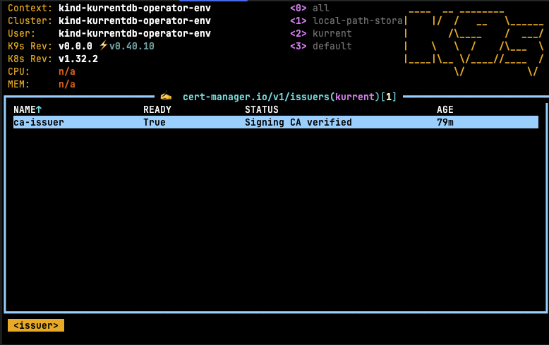
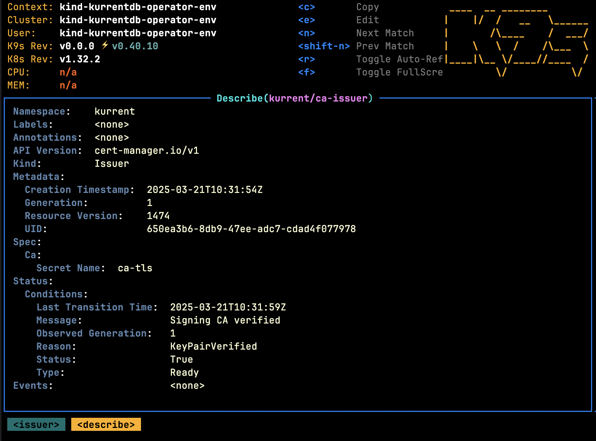

The Operator expects consumers to leverage a third-party tool to generate TLS certificates that can be wired in to [KurrentDB](../getting-started/resource-types.md#kurrentdb) deployments using secrets. The sections below describe how certificates can be generated using popular vendors.

## Picking certificate names

Each node in each KurrentDB cluster you create will advertise a fully-qualified domain name (FQDN).
Clients will expect those advertised names to match the names you configure on your TLS
certificates.  You will need to understand how the FQDN is calculated for each node in order to
request a TLS certificate that is valid for each node of your KurrentDB cluster.

By default, the [network.fqdnTemplate field of your KurrentDB spec](
../getting-started/resource-types.md#kurrentdbnetwork) is
`{podName}.{name}{nodeTypeSuffix}.{domain}`, which may require multiple wildcard names on your
certificate, like both `*.myName.myDomain.com` and `*.myName-replica.myDomain.com`.  You may prefer
to instead configure an `fqdnTemplate` like `{podName}.{domain}`, which could be covered
by a single wildcard: `*.myDomain.com`.

## Certificate Manager (cert-manager)

### Prerequisites

Before following the instructions in this section, these requirements should be met:

* [cert-manager](https://cert-manager.io) is installed
* You have the required permissions to create/manage new resources on the Kubernetes cluster
* The following CLI tools are installed and configured to interact with your Kubernetes cluster. This means the tool must be accessible from your shell's `$PATH`, and your `$KUBECONFIG` environment variable must point to the correct Kubernetes configuration file:
    * [kubectl](https://kubernetes.io/docs/tasks/tools/install-kubectl)
    * [k9s](https://k9scli.io/topics/install/), optional

### Using trusted certificates via LetsEncrypt

To use LetsEncrypt certificates with KurrentDB, follow these steps:

1. Create a [LetsEncrypt Issuer](#letsencrypt-issuer)
2. Future certificates should be created using the `letsencrypt` issuer

### LetsEncrypt Issuer

`cert-manager` documents how to integrate with [each of their supported DNS providers][cm-dns01],
and the following example shows how a LetsEncrypt Issuer can be deployed after you have
[integrated cert-manager with AzureDNS][cm-az]:

[cm-dns01]: https://cert-manager.io/docs/configuration/acme/dns01/
[cm-az]: https://cert-manager.io/docs/configuration/acme/dns01/#supported-dns01-providers

```yaml
apiVersion: cert-manager.io/v1
kind: Issuer
metadata:
  name: letsencrypt
  namespace: kurrent
spec:
  acme:
    server: https://acme-v02.api.letsencrypt.org/directory
    email: <YOUR_EMAIL_ADDRESS>
    privateKeySecretRef:
      name: letsencrypt-issuer-key
    solvers:
    - dns01:
        azureDNS:
          hostedZoneName: <YOUR_AZURE_ZONE_NAME>
          resourceGroupName: <YOUR_AZURE_RESOURCE_GROUP>
          subscriptionID: <YOUR_AZURE_SUBSCRIPTION_ID>
          environment: AzurePublicCloud
          managedIdentity:
            clientID: <YOUR_LETSENCRYPT_CLIENT_ID>
```

This can be deployed using the following steps:
- Replace the variables `<...>` with the appropriate values
- Copy the YAML snippet above to a file called `issuer.yaml`
- Run the following command:

```bash
kubectl apply -f issuer.yaml
```

### Using Self-Signed certificates

To use self-signed certificates with KurrentDB, follow these steps:

1. Create a [Self-Signed Issuer](#self-signed-issuer)
2. Create a [Self-Signed Certificate Authority](#self-signed-certificate-authority)
3. Create a [Self-Signed Certificate Authority Issuer](#self-signed-certificate-authority-issuer)
4. Future certificates should be created using the `ca-issuer` issuer

### Self-Signed Issuer

The following example shows how a self-signed issuer can be deployed:

```yaml
apiVersion: cert-manager.io/v1
kind: Issuer
metadata:
  name: selfsigned-issuer
  namespace: kurrent
spec:
  selfSigned: {}
```

This can be deployed using the following steps:
- Copy the YAML snippet above to a file called `issuer.yaml`
- Run the following command:

```bash
kubectl apply -f issuer.yaml
```

### Self-Signed Certificate Authority

The following example shows how a self-signed certificate authority can be generated once a
[self-signed issuer](#self-signed-issuer) has been deployed:

```yaml
apiVersion: cert-manager.io/v1
kind: Certificate
metadata:
  name: selfsigned-ca
  namespace: kurrent
spec:
  isCA: true
  commonName: ca
  subject:
    organizations:
      - Kurrent
    organizationalUnits:
      - Cloud
  secretName: ca-tls
  privateKey:
    algorithm: RSA
    encoding: PKCS1
    size: 2048
  issuerRef:
    name: selfsigned-issuer
    kind: Issuer
    group: cert-manager.io
```

:::note
The values for `subject` should be changed to reflect what you require.
:::

This can be deployed using the following steps:
- Copy the YAML snippet above to a file called `ca.yaml`
- Ensure that the `kurrent` namespace has been created
- Run the following command:

```bash
kubectl apply -f ca.yaml
```

### Self-Signed Certificate Authority Issuer

The following example shows how a self-signed certificate authority issuer can be generated once a
[CA certificate](#self-signed-certificate-authority) has been created:

```yaml
apiVersion: cert-manager.io/v1
kind: Issuer
metadata:
  name: ca-issuer
  namespace: kurrent
spec:
  ca:
    secretName: ca-tls
```

This can be deployed using the following steps:
- Copy the YAML snippet above to a file called `ca-issuer.yaml`
- Ensure that the `kurrent` namespace has been created
- Run the following command:

```bash
kubectl apply -f ca-issuer.yaml
```

Once this step is complete, future certificates can be generated using the self-signed certificate authority. Using k9s,
the following issuers should be visible in the `kurrent` namespace:



Describing the issuer should yield:



## Migrating Certificate Authorities

If for some reason you need to migrate Certificate Authorities (for example, switching from one
self-signed CA to another), the process follows three steps:

1. Update your `KurrentDB.spec.security.certificateAuthoritySecret`:
   - First, ensure the named Secret contains only CAs; the database will not start if you have your
     TLS keys or other contents in the same Secret.
   - Add your new CA as a new key to the Secret, leaving the old CA in place.
   - Remove the `.keyName` field to indicate you want all keys of the Secret mounted into database
     pods as trusted CAs.
   - Wait for the KurrentDB resource to return to the `database-healthy` state.
   - Handle possible race condition; see below.

2. Update your `KurrentDB.spec.security.certificateSecret`:
   - Switch to the TLS keypair signed by the new CA.  You may either configure your KurrentDB to
     reference a new Secret (which will cause a rolling restart) or update the content of the
     currently-referenced Secret (which will cause a config reload, no node downtime).
   - Wait for the KurrentDB resource to return to the `database-healthy` state.

3. Update your `KurrentDB.spec.security.certificateAuthoritySecret` again:
   - Remove the old CA you no longer wish to trust.
   - Restore the `.keyName` if desired.
   - Wait for the KurrentDB resource to return to the `database-healthy` state.

During step 1, the Operator requests the mounted pod secrets to be resynced, then waits 10 seconds,
then requests the database pods to reload their configs (including trusted CA list).  If the kubelet
is under very heavy load, it may not have actually synced the secrets into the pods by the time the
database reloads.  For TLS key pair changes, the Operator can detect and remediate that race
condition.  However, with CA list changes, the Operator cannot tell if the race occurred.  The race
condition is rare, however, if it occurs and it is unaddressed, then step 2 will result in a full
restart, which is unnecessary downtime.

To guarantee no unnecessary downtime, you may take one of the following actions:

- You can exec into the pods, confirm that your updates appear in `/kurrentdb/ca` directory (or
  `/eventstore/ca` for older database versions), then trigger another config reload by bumping the
  `.spec.configReloadKey` string to any new value.

- You can simply wait a few minutes then bump the `.spec.configReloadKey`.  How long you need to
  wait is governed by the kubelet's `syncFrequency` and `configMapAndSecretChangeDetectionStrategy`
  strategy.  For default kubelet settings, you need to wait at least one minute.

- If you have multiple nodes, you may issue an immediate rolling restart by bumping the
  `.spec.rollingRestartKey` string to any new value.  When nodes restart they are guaranteed to
  mount the latest secrets.
