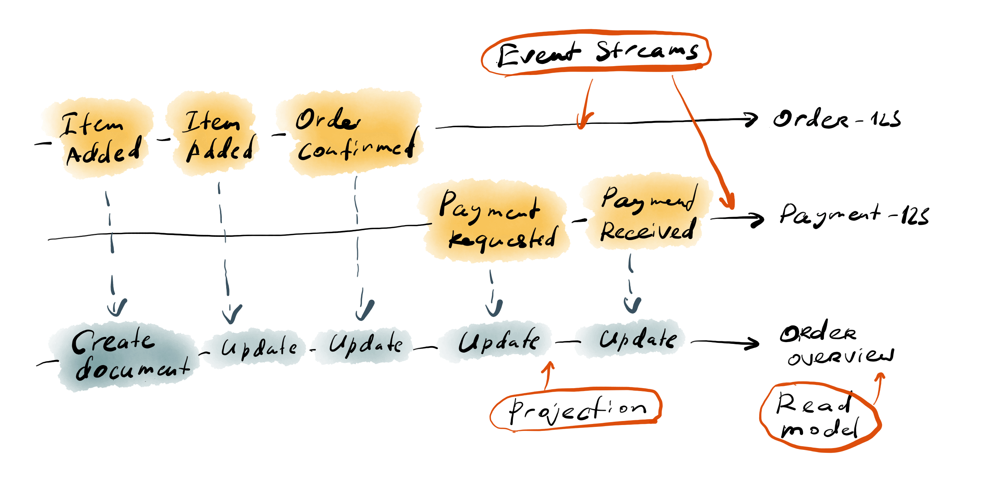
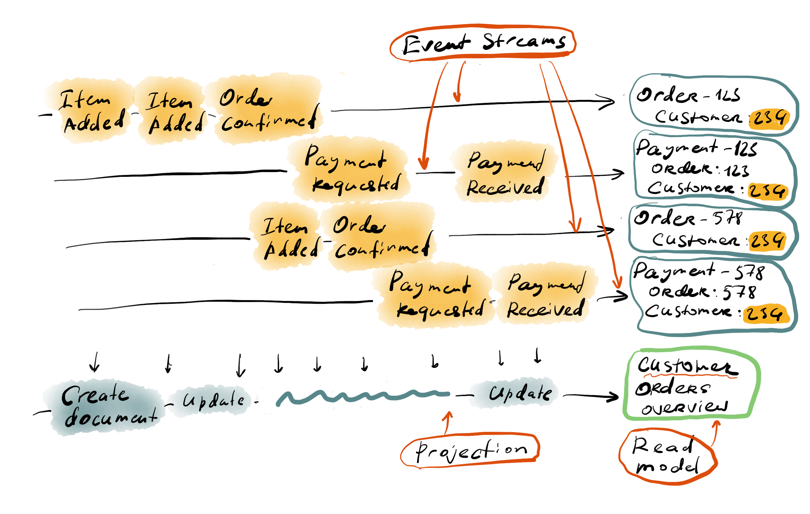

# Global event stream

[This guide](./projections.md) describes projection basics. However, subscribing to a single event stream that represents an entity (for example) isn't useful. The projection code can handle any event that comes from the domain model and build sophisticated read models that serve a variety of needs.

For example, we might need to show user a page that contains order details, including payment and shipping information. It might be that the domain model splits those concerns to different aggregates with an independent lifecycle, since they address different concerns. One common approach is to compose such a page on the front-end side and call multiple API endpoints to collect the information from different parts of the system. Albeit such an approach can be useful, with Event Sourcing we have an option to build a read model, which would represent all the information for that page. By doing so, the need to call multiple API endpoints and do somewhat complex data composition in the UI disappears.

Conceptually, to achieve the goal like that, a projection needs to receive events from different streams.

::: el-card :body-style="{ padding: '0px' }" 

:::

The projection will then create a read model for each order and project both order information and payment information to it.

In this case, the subscription that feeds the projection with events has to subscribe to some stream that contains all the events from entities of different types, with different ids. 

## '$all' stream

In Event Store, the concept of individual stream builds on top of the single event sequence, which is called the `$all` stream.

::: tip
Streams with names starting with `$` are considered system streams, but it doesn't mean you can't use them.
:::

It means that each new event gets appended to the global event sequence. The stream name for that event serves for event indexing, so you can read a subset of events by using the stream name. However, the stream name doesn't tell Event Store where the event needs to be persisted, since all the events go to the global append-only store. Because of this internal structure of the persistence, Event Store allows subscribing to the global stream of events. Client libraries have a special method for subscriptions to connect to that stream.

```csharp
var subscription = connection.SubscribeToAllFrom(
    lastCheckpoint: lastCheckpoint ?? AllCheckpoint.AllStart,
    settings: CatchUpSubscriptionSettings.Default,
    eventAppeared: EventAppeared);
```

The API for the `SubscribeToAllFrom` is almost identical to `SubscribeToStreamFrom` but the checkpoint is not represented as a long integer number but as a struct with two long integers - prepare position and commit position. The meaning of those two numbers is covered in ... // TODO. Therefore, the checkpoint store needs to support storing the `Position` struct instead of a simple number.

The most useful thing about the global event stream is that all events in it are ordered and any subscription that uses the `$all` stream will get events in the same order as they were written to Event Store, even if events were appended to different logical streams. That way projections can be reassured that things that must happen in order will do so, as long as the write-side of the application behaves correctly.

The illustration above shows that one projection handles events for two different event types to construct the read model with the full order overview. In order for the projection to handle payment events, those events need to contain the order id, so the projection could understand which overview record needs updating, since those records are created for each individual order.

## Read model scope

When developers come to Event Sourcing with a substantial experience of persisting domain objects in traditional databases, they rarely resist an urge to build projections that build the current entity state as a read model. By doing so, they return to the comfort zone of being able to check the current state of any domain object, at any time by looking into the database. However, such an approach doesn't really deliver the full power of CQRS combined with Event Sourcing.

One of the great outcomes of having an event-sourced system is the ability to create new read models at will, at any time, without affecting anything else. For example, if you find your read models in MongoDB to be not fitting the full-text search requirement, you can build a new projection targeting ElasticSearch with a limited set of fields that the full-text search function needs. Similarly, it is possible to build new aggregations or sets of denormalized data with the goal to have pre-calculated pages available for the UI to show, instead of running expensive queries every time a user opens that page.

Continuing the previous illustrations and snippets, our eCommerce system might one day require a page that shows all the orders for one single customer. It is possible to build an API endpoint that runs a query for that purpose. There are drawbacks for adding queries though since each query potentially introduces side effects on the database, like space used for indexes, degraded performance and so on. Some databases won't even let you query without changing the persistence model significantly. Building a new read model, however, is relatively straightforward.

::: el-card :body-style="{ padding: '0px' }" 

:::

One thing to remember is that all the events included in such aggregation need to have a field that conveys the aggregation id (customer id in this case). It might be problematic if the original event schema didn't contain enough data. It's not exactly straightforward, but this problem has several solutions, like stream joins (enrichment), upcasting, migration and so on. Those patterns are out of scope for this article.

Here are some references for further reading:
- [Patterns for Decoupling in Distributed Systems: Fat Event][1] by Mathias Verraes
- [Designing Data-Intensive Applications][4] by Martin Kleppmann (page 473 describes stream enrichment)
- [Upcasting events to new schema][2] example from the [Hands-On DDD with .NET Core][3] book by Alexey Zimarev

[1]: https://verraes.net/2019/05/patterns-for-decoupling-distsys-fat-event/
[2]: https://github.com/PacktPublishing/Hands-On-Domain-Driven-Design-with-.NET-Core/tree/master/Chapter11/in-database/Marketplace/Projections
[3]: https://www.packtpub.com/application-development/hands-domain-driven-design-net-core
[4]: https://dataintensive.net/
