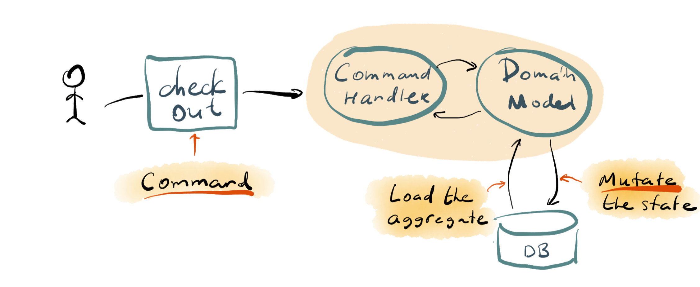
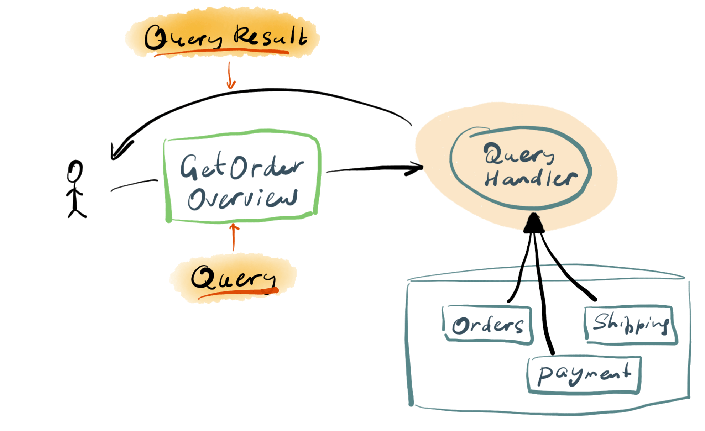

# Event Sourcing and CQRS

CQRS states for _Command-Query Segregation Principle_. Greg Young described (and named) the 
pattern thoroughly in 2010, but the idea existed way before that time. On a high level,
CQRS states the fact that operations that trigger state transitions should be
described as _commands_ and any data retrieval that goes beyond the need of the
command execution, should be named a _query_. Because the operational
requirements for executing commands and queries are very often different, developers
should consider using different persistence techniques for handling commands and queries,
therefore segregating them.

## Operations vs Reporting

Most of the software systems need to persist data. Since for the scope of this guide we
assume that the business logic of a software system is represented and executed
by the Domain Model, we can say that an application persistence focuses on
persisting domain objects, like aggregates and entities. Because domain objects
often have rather complex structure, developers might require applying advanced
persistence techniques to overcome the impedance mismatch. The Domain Model-oriented
persistence is optimised for transactional performance, because the essential function
of the Domain Model is to execute operations that trigger state transitions in the system,
according to the logic and rules of the model.

Such an approach, however, could create challenges when it comes to retrieving
data for reporting purposes. 

::: tip
Don't see reporting as an act of creating a PDF or CSV
file. Each query to the database that aims to get some data in order to show it
to the user or return the result set of an API call is also reporting.
:::

The challenge surfaces from the fact that reporting needs are often drastically
different from the needs of executing transactional operations. In addition,
many systems have a clear imbalance between the number of writes and reads.
For example, a typical user-facing application would have much less writes than reads,
because users normally read the information provided by the system and only
seldom execute operations in the systems. Some systems, however, have the opposite
imbalance with prevailing writes. You might think of a back-office of your bank,
or a vehicle tracking system as examples.

One of the first traces of the original discussion around the reporting issue
when using the Domain Model pattern happened during the [The challenge of executing DDD](https://dddcommunity.org/uncategorized/evans_2004_3/)
panel with Martin Fowler, Eric Evans and others, back in 2004. Also in 2004,
Martin Fowler published the [ReportingDatabase](https://martinfowler.com/bliki/ReportingDatabase.html)
pattern in Bliki. The pattern suggests using a separate database for reporting
purposes and push changes from the operational database to that reporting database.

> Source: [Martin Fowler's bliki](https://martinfowler.com/bliki/ReportingDatabase.html)

The Reporting Database pattern, albeit, is only similar to CQRS but not exactly the same.
Indeed, it aims to solve the similar issue, but gets confused with the term _reporting_.
In the Reporting Database pattern context, reporting has a more traditional meaning.

The kick-off question of the aforementioned panel discussion is:

> On the other hand business execs want / crave / require “ad-hoc” reporting, with the degree of “ad-hoc-ness” varying from simple reports to data warehouses.
> You’d like to simply write some SQL and stuff the results into a report, but this is impossible when you have the domain model supporting all of your complex logic.
> So, what do you do?

So here, _reporting_ only covers something that is accessed now and then. Such a report
is only actual at the moment it gets produced, just as a printed report.

CQRS, however, assumes that any query is some sort of report, would it be
moved across, printed out or shown to the user inside the application.

## Commands vs Queries

Developers often confuse CQRS with the Reporting Database pattern, albeit there is
nothing in the name (Command-Query Responsibility Segregation) suggests that.

The essence of CQRS is to separate command flow from the query flow, based on
fundamental characteristics of those concepts.

### Commands

The main attribute of a command that when the command gets successfully executed,
the system transitions to a new state.

Another important attribute of a command is that it conveys the intent of the user.
So, requests like `UpdateCustomer` are not exactly commands according to CQRS.
Within the application boundaries, handling a command should result in one
transaction on one Aggregate.

As a consequence, the command flow in CQRS goes hand in hand with Task-Based User Interface
pattern. In contrast with CRUD-based user interface, which has four basic operations available
for users - Create, Edit, Save and Delete, task-based UI makes each operation
explicit, like Check Out, Add Item or Cancel Order. By doing that, it makes
operations available to the user easily translatable to commands that the UI
sends to the Domain Model via an API.

### Queries

Queries, as the name suggest, allow getting data from the persistent store, so
it can be shown to the user, sent to another system or used for any other purpose.

::: tip
Although the image shows all the system elements stored in what looks like a
single database, it is just an example and doesn't have to be that way.
:::

Unlike commands, queries do not need to involve the Domain Model because queries
do not execute any operations and should not contain any business logic. In addition,
queries have no side effects and are completely idempotent, so it doesn't matter
how many times the query gets executed - it will always return the same result,
unless the system state changed in the meantime.

Therefore, when implementing a query handler, developers don't need to use the same
way to access data as they do when persisting domain objects. For example,
if the Domain Model persistence uses some ORM framework that distribute state of
domain objects across tables in a relational database, a query could fire an
SQL statement that ignores the ORM and gets the data directly from those tables. 

CQRS also suggests that queries target specific use cases and return a pre-composed
data set that can be shown in its entirety on the screen or in a cohesive part
of the screen.

## CQRS with Event Sourcing

It is not a coincidence that Greg proposed the CQRS pattern at the same time as
he introduced Event Sourcing to the public. Unlike state-based persistence,
where there might be a way to avoid using the domain model for queries, such
an approach is hard to impossible to use in event-sourced systems. It is because
there is no place where the state of a domain object is stored entirely.

As described in the previous article, domain entities in event-sourced systems are
stored as event streams, essentially each entity is a sequence of events from the
persistence point of view. There is more to it yet. Domain events in event store
alone do not allow reconstructing the entity state without knowing the logic that
the entity uses to rehydrate its own state from events and this logic is in
code of the Domain Model.

### Projections

Therefore, we need a way to project events to an alternative store, which we can
easily query. It could be a relational or document database, or cache, or any
other type of persistence that is applicable for a specific use case.

So, the idea is that a software component called a _Projection_ subscribes
to the live event feed of the events database and when it receives an event,
it could _project_ the information in that event to a query model in a
dedicated reporting database.

::: tip
In the context of CQRS you often hear _write side_, _read side_ and 
_read model_. The _write side_ is the command side, since that's the place
where state mutations, also referred as _writes_ take place. By analogy,
the query side is often being referred as the _read side_, and the query model
gets by name _read model_.
:::

Because the query side of CQRS in event-sourced systems is a bit more tricky than
the command side, we dedicate the next article entirely to that topic.
