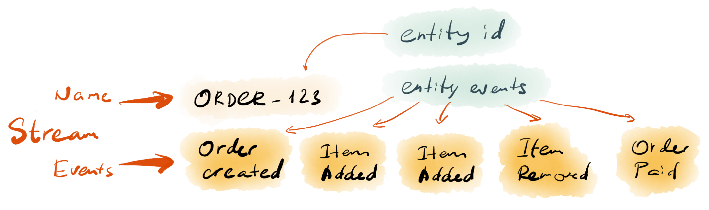

# Entities as event streams

In the previous article, we got an overview of what is Event Sourcing and what 
is the domain event. Now, let's see how we can change the way how we persist 
entities using events.

::: tip
The code in this article is the C#-styled pseudo code.
:::

## Command handling flow

Since we already use the order example, we can compose an entity that represents 
an order:

```csharp
public class Order {
    OrderId id;
    OrderItem[] items;
    Money totalAmount;

    public AddItem(OrderItem newItem) {
        if (!CanAddItem(item))
            throw new DomainException("Unable to add the item");

        items.Add(newItem);
        totalAmount = totalAmount.Add(newItem.LineTotal);
    }
}
```

In this example, we use the Domain Model pattern, so the entity has both state 
and behaviour. State transitions occur when we call entity methods, so the 
flow of execution for any operation would look like this:


In case our application uses Ports and Adapters architecture, we would
have an application service, which handles the command:

```csharp
public class OrderService {
    EntityStore store;

    public Response Handle(AddOrderItem command) {
        var order = store.Load<Order>(command.OrderId);
        var orderItem = OrderItem.FromCommand(command.Item);
        order.AddItem(orderItem);
        store.Save(order);
    }
}
```

Most certainly, we'd also have an edge adapter, like HTTP that accepts commands
from the outside world, but it's out of scope for this article.

## Event-based entity

Now, let's see what needs to change for our application to use Event Sourcing.

### Event as code

First, we need an event that represents the state transition:

```csharp
public class ItemAdded {
    public string OrderId;
    public Shared.OrderItem Item;
    public double Total;
}
```

::: tip
Notice that event properties are primitive types or shared complex types, which
are used to remove code duplication. Hence, that all the types used for events,
including shared types, are just property bags (DTOs) and should not contain
any logic. The main attribute of those types is that they must be serializable.
:::

The event now describes the domain-specific behaviour and contains enough
information to mutate the `Order` entity state.

### Producing events

Second, we need to change the entity code, so it will generate an event:

```csharp
public class Order {
    OrderId id;
    OrderItem[] items;
    Money totalAmount;

    public AddItem(OrderItem newItem) {
        if (!CanAddItem(item))
            throw new DomainException("Unable to add the item");

        var newTotal = totalAmount.Add(newItem.LineTotal).AsDouble;
        Apply(
            new ItemAdded {
                OrderId = id,
                Item = Map(newItem),
                Total = newTotal
            }
        );
    }
}
```

At this stage, the `AddItem` method doesn't directly mutate the entity state, but
produces an event instead. It uses the `Apply` method, which doesn't exist
in the `Order` class yet, so we need to implement it.

### Collect changes

Every new event is a change. The `Order` class should keep track of all the 
changes that happen during the command execution flow, so we can persist
those changes in the command handler. Such a behaviour is generic and not
unique to the `Order` class, so we can make an abstract class to isolate
the technical work in it:

```csharp
public abstract class Entity {
    List<object> changes;

    public void Apply(object event) {
        changes.Add(event);
    }
}
```

We can now change the `Order` class to inherit from the `Entity` class, and the
code will compile. However, you'd notice that the entity state doesn't change
when we produce a new event. It might be not a problem if we only produce one 
event when handling a command, but that's not always the case. For example,
when adding a new item we could produce two events: `ItemAdded` and `TotalUpdated`
to make state changes more explicit and atomic. In some cases, the code that
produces consequent events, still being in the same transaction, need to know 
the new entity state, changed by the previous event. Therefore, we need to
mutate the state in-process when we apply each event.

### Using events to mutate state

Let's first implement the method that mutates the entity state using events.
It's common to call this method `When`. So, we can add an abstract method to
the base class and ensure it's called when we add new events to the list
of changes:

```csharp
public abstract class Entity {
    List<object> changes;

    public void Apply(object event) {
        When(event);
        changes.Add(event);
    }

    protected abstract void When(object event);
}
```

Now, we can implement the `When` method in the `Order` class:

```csharp
public class Order {
    OrderId id;
    OrderItem[] items;
    Money totalAmount;

    public AddItem(OrderItem newItem) {
        if (!CanAddItem(item))
            throw new DomainException("Unable to add the item");

        var newTotal = totalAmount.Add(newItem.LineTotal).AsDouble;
        Apply(
            new ItemAdded {
                OrderId = id,
                Item = Map(newItem),
                Total = newTotal
            }
        );
    }

    protected void When(object event) {
        switch (event) {
            case ItemAdded e:
                items.Add(OrderItem.FromEvent(e.Item));
                totalAmount = e.Total;
                break;
        }
    }
}
```

Essentially, in order to restore the entity state from events, we need to apply the left [fold](https://en.wikipedia.org/wiki/Fold_(higher-order_function)) on all the events in the entity stream.

With all those changes, the `Order` class public API hasn't changed. It still
exposes the `AddItem` method and only the internal implementation is different.

## Using events for persistence

Now, let's get back to the original command handling flow and see how it changed
since we started using events.

In fact, the overall flow is the same, so is the application service code.
The only change would be how the `EntityStore` adapter works. For state-oriented
persistence, it could be something like putting the entity state to a document, 
serialising it and storing it in a document database, and then reading it back.
How would it look like when we have an event-sourced entity? We use the same
port, so the API doesn't change. We need to implement an adapter that can
use an event-oriented database, like Event Store.

In terms of persisting objects, the main use case for an event database is to
be able to store and load events for a single object or entity, using the entity
identifier. The main difference is that when you use a relational or document database
and use the entity id to get the data, you get a single record, which directly
represents the current entity state. In contrast, when you retrieve an entity from
an event database, you get multiple records for one id and each record in the set
is an event.

Therefore, the whole set of events that represents a single entity has one unique
identifier. Since we don't have a single record, which is assigned to that identifier,
we call that event set a _stream_. The stream is an ordered collection of events
for a single object in the system. The object identifier combined with the object type
is often used as the stream name.



When we read all events from a single entity stream, we can reconstruct the 
current state by calling the `When` method for all the events, in sequence.

With an abstract event-oriented database, the `EntityStore` adapter would look
similar to the code below:

```csharp
public class EntityStore {
    EventDatabase db;
    Serializer serializer;

    public void Save<T>(T entity) where T : Entity {
        var changes = entity.changes;
        if (changes.IsEmpty()) return; // nothing to do

        var dbEvents = new List<DbEvent>();
        foreach (var event in changes) {
            var serializedEvent = serializer.Serialize(event);
            dbEvents.Add(
                data: new DbEvent(serializedEvent),
                type: entity.GetTypeName();
            );
        }
        var streamName = EntityStreamName.For(entity);
        db.AppendEvents(streamName, dbEvents);
    }

    public T Load<T>(string id) where T : Entity {
        var streamName = EntityStreamName.For(entity);
        var dbEvents = db.ReadEvents(streamName);
        if (dbEvents.IsEmpty()) return default(T); // no events

        var entity = new T();
        foreach (var event in dbEvents) {
            entity.When(event);
        }
        return entity;
    }
}
```

::: tip
This page doesn't cover concepts like optimistic concurrency using versions
and specific aspects like mapping event types for serialisation.
:::

One important thing to mention here is that the code that mutates the entity
state based on the information stored in events, should not have any
advanced logic or calculations. Preferably, the event already contains
all the required information, so the `When` method can use it directly to
change entity state properties. By following this pattern, you will ensure
that state transitions are stable, and the current entity state will always
be predictable.
